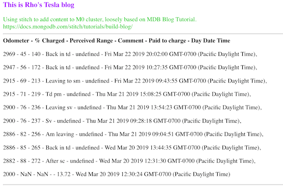
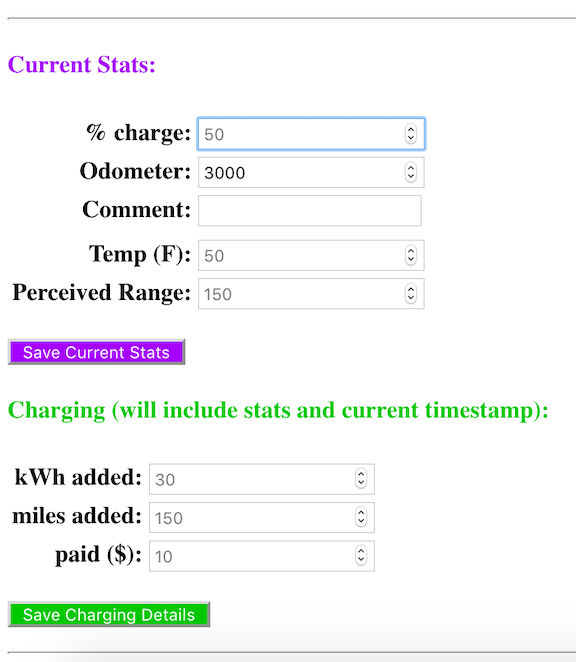

# MDB-Stitch-html
Initial attempt at MDB stitch project
based on Tutorial for **Basic Blog** at https://docs.mongodb.com/stitch/tutorials/build-blog/

Allows data entry for and listing of simple Electric Car Power Stats based on Odometer reading, % charge, Temperature

This is a "sanitized" version of the html file since no authentication restrictions are applied

## To use please:

- follow **Basic Blog** tutorial listed above
     - create own Atlas Cluster (M0 is free)
     - create own Stitch App linked to own Atlas Cluster
- replace
     - `<mongodb-atlas>` with own Atlas Cluster name
     - `<stitch-application-name>` with own Stitch Application name

## Example of html list (top portion)

## Current data entry portion (lower portion)

## Next steps: 

(not necessarily in this order)

- [x] update readme with images
- [ ] add authentication based on gmail account
- [ ] attempt conversion to Android App
- [x] (Optional) determine source of and remove leading commas in list (moved to end)
- [x] add charging details to list on top (cost only)
- [ ] add charts portion to provide results such as cost per mile or loss of charge

