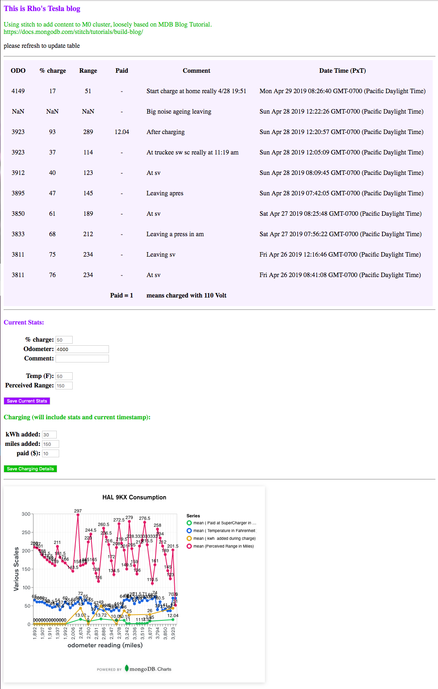

# MDB-Stitch-html

Allows data entry for and listing of simple Electric Car Power Stats based on Odometer reading, % charge, Temperature

Initial attempt at MDB stitch project based on Tutorial for [**Basic Blog**](https://docs.mongodb.com/stitch/tutorials/build-blog/) in Feb 2019. 

~ March 2019 docs were updated to [Blog App Overview](https://docs.mongodb.com/stitch/tutorials/blog-overview/) separating [Blog App: Create the Backend](https://docs.mongodb.com/stitch/tutorials/guides/blog-backend/) and [Blog App: Create a Web Client](https://docs.mongodb.com/stitch/tutorials/guides/blog-web/). The updated docs simplified steps, and will still work as a baseline for modification.

This is a "sanitized" version of the html file since no authentication restrictions are applied

## To use please:

- follow **Basic Blog** tutorial listed above
     - create own Atlas Cluster (M0 is free)
     - create own Stitch App linked to own Atlas Cluster
- replace
     - `<mongodb-atlas>` with own Atlas Cluster name
     - `<stitch-application-name>` with own Stitch Application name
- for charts
    - [Documentation for Building Charts](https://docs.mongodb.com/charts/saas/build-charts/)
    - [Blog post](https://www.mongodb.com/blog/post/mongodb-charts-gets-embeddable)
    - [Documentation for Embedding Charts](https://docs.mongodb.com/charts/saas/embedding-charts/?_ga=2.5683571.1534861390.1556568243-1519337452.1540396341)

## Example display (list and data entry)

## Next steps: 

(not necessarily in this order)

- [x] update readme with images
- [ ] add authentication based on gmail account
- [ ] attempt conversion to Android App
- [x] (Optional) determine source of and remove leading commas in list (1. moved to end, 2. replaced list with table)
- [x] add charging details to list on top (cost only)
- [x] add charts portion 
- [ ] optimize chart to provide results such as cost per mile or loss of charge (need more accurate data of home charging)

